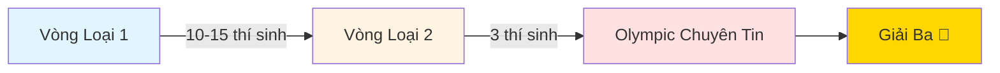

<div align="center">

# 🏆 Olympic Sinh Viên 2025 - Chuyên Tin

### Hành trình đạt Giải Ba Khối Chuyên Tin

[](https://huce.edu.vn/)
[](https://oj.vnoi.info/contests/)
[](https://github.com/Minhduc7904)

</div>

---

## 👨‍💻 Giới thiệu

Xin chào! Mình là **Nguyễn Minh Đức**, sinh viên năm 4 trường **Đại học Xây Dựng Hà Nội (HUCE)**. 

Repo này ghi lại toàn bộ **hành trình chuẩn bị và thi Olympic Sinh Viên 2025 - Khối Chuyên Tin** của mình, từ kiến thức, code mẫu đến kinh nghiệm thực chiến.

<div align="center">

### 🎯 Thành tích

| Cuộc thi | Địa điểm | Kết quả |
|----------|----------|---------|
| **OLP Chuyên Tin 2025** | HUTECH - TP.HCM (Thủ Đức) | 🥉 **Giải Ba** |

</div>

---

## 📚 Nội dung Repository

Repository này bao gồm:

- ✅ **Tổng hợp kiến thức** ôn tập trong 1 tháng trước khi thi
- ✅ **Code solutions** cho các bài tập thực hành
- ✅ **Contest files** từ HUCE organization trên VNOI
- ✅ **Chiến thuật thi** và kinh nghiệm thực chiến

> **Lưu ý:** Mình đã có nền tảng từ năm 2024, nên năm 2025 chủ yếu ôn lại và luyện tay. Một số contest cũ từ 2024 chưa được cập nhật vào repo này.

---

## 🛣️ Lộ trình thi Olympic

<div align="center">



</div>

### Các vòng thi:

1. **🔵 Vòng Loại 1:** Chọn 10-15 bạn xuất sắc nhất
2. **🟡 Vòng Loại 2:** Chọn 3 bạn đại diện trường thi Olympic
3. **🔴 Olympic Chuyên Tin:** Thi chính thức, 4 bài trong 3 giờ

---

## 📝 Cấu trúc đề thi

<table>
<tr>
<td width="50%">

### 📋 Thông tin chung
- **Số bài:** 4 bài
- **Thời gian:** 3 giờ
- **Tổng điểm:** 400 điểm
- **Đặc điểm:** Mỗi bài có nhiều subtask

</td>
<td width="50%">

### 💡 Độ khó từng bài
| Bài | Độ khó | Điểm dễ lấy |
|-----|--------|-------------|
| Bài 1 | ⭐⭐ Dễ | ✅ Cao |
| Bài 2 | ⭐⭐ Dễ | ✅ Cao |
| Bài 3 | ⭐⭐⭐⭐ Khó | ⚠️ Thấp |
| Bài 4 | ⭐⭐⭐⭐⭐ Rất khó | ⚠️ Thấp |

</td>
</tr>
</table>

> 🔗 **Xem đề chính thức tại:** [oj.vnoi.info/contests](https://oj.vnoi.info/contests/)

---

## 🎯 Chiến thuật thi của mình

### ✅ Chiến thuật áp dụng (Đúng)

```
┌─────────────────────────────────────────────────────┐
│  2 TIẾNG ĐẦU: Quét 4 bài → Làm hết subtask dễ       │
│  ✓ Kết quả: 96/400 điểm trong 2 giờ                 │
└─────────────────────────────────────────────────────┘
```

**Các bước thực hiện:**

1. 📖 **Đọc lướt cả 4 bài** để nắm độ khó
2. 🎯 **Làm hết subtask dễ** của cả 4 bài trước
3. 🔄 **Quay lại tối ưu** các bài còn thiếu điểm
4. ⏰ **Quản lý thời gian** cho từng bài

### ❌ Sai lầm trong giờ cuối

<div style="background: #fff3cd; padding: 15px; border-left: 4px solid #ffc107; margin: 10px 0;">

**⚠️ Bài học kinh nghiệm:**

Trong 1 giờ cuối, mình đã **sai lầm** khi:
- ❌ Cố tối ưu Bài 3, 4 (khó, điểm thấp)
- ❌ Bỏ qua Bài 1, 2 (dễ, dễ cải thiện)

**Điều đáng tiếc:**
- Bài 1: Có thể lấy thêm **+30 điểm** rất dễ (mình chỉ nghĩ ra muộn và lấy được +5đ)
- Bài 2: Có thể lấy thêm **+30 điểm** với effort hợp lý

</div>

### 💡 Bài học rút ra

> **Tâm lý và chiến thuật là then chốt!** Nên ưu tiên tối ưu các bài dễ trước, vì điểm/effort cao hơn nhiều so với các bài khó.

<div align="center">

| Chiến lược | Ưu tiên | Lý do |
|------------|---------|-------|
| ✅ **Tối ưu Bài 1, 2 trước** | 🟢 Cao | Dễ lấy điểm, effort thấp |
| ⚠️ **Tối ưu Bài 3, 4 sau** | 🔴 Thấp | Khó, tốn thời gian, điểm thấp |

</div>

---

## 🔗 Tài nguyên học tập

### 📌 Nguồn chính

- **VNOI - HUCE Organization:** [oj.vnoi.info/organization/HUCE](https://oj.vnoi.info/organization/HUCE)
  - Chứa tất cả các contest thực hành
  - Cần tài khoản HUCE để truy cập đề bài

### 🙏 Lời cảm ơn

Đặc biệt cảm ơn **Anh Hiệu** - cựu học sinh HUCE:
- 📖 Viết giáo án chi tiết
- 🎯 Tạo contest trên VNOI HUCE
- 🧭 Hướng dẫn và định hướng ôn tập

---

## 📊 Cấu trúc thư mục

```
📦 on_thi_olp_2025
├── 📁 OLP/                    # Đề thi chính thức
├── 📁 vong_loai1/             # Vòng loại 1
├── 📁 vong_loai2/             # Vòng loại 2
├── 📁 tu_hoc/                 # Bài tập tự học
│   ├── backtrack/
│   ├── huce_dp1/
│   ├── set1/
│   └── tuan2/
├── 📁 tong_hop/               # Tổng hợp kiến thức
│   ├── 01_bit_operations/
│   ├── 02_stl/
│   ├── 03_segment_tree/
│   ├── 04_string/
│   ├── 05_dynamic_programming/
│   ├── 06_graph/
│   └── 07_math/
└── 📄 README.md
```

---

## 💪 Lời khuyên cho các bạn

<div style="background: #d1ecf1; padding: 15px; border-left: 4px solid #0c5460; margin: 10px 0;">

### 📚 Nguồn học chính:
> **Tất cả kiến thức mình học đều có trên:** [wiki.vnoi.info](https://wiki.vnoi.info/)

**Chiến lược học của mình:**
- 📖 Học theo **VNOI Wiki** - nguồn tài liệu chất lượng, đầy đủ
- ⭐ Chỉ tập trung vào **bài tập độ khó 2 sao** (★★)
- 🎯 Không cần học quá sâu, tập trung vào nền tảng vững chắc
- 💡 Hiểu rõ concept > Học nhiều thuật toán phức tạp

**Lý do chọn bài 2 sao:**
- ✅ Đủ nền tảng cho Olympic Chuyên Tin
- ✅ Không quá khó, dễ nắm bắt
- ✅ Cover được hầu hết các subtask dễ trong đề thi
- ✅ Tiết kiệm thời gian, hiệu quả cao

### 🎯 Trước khi thi:
- ✅ Học theo **VNOI Wiki** (chỉ cần bài 2 sao)
- ✅ Ôn kỹ các thuật toán cơ bản
- ✅ Luyện code thường xuyên trên VNOI
- ✅ Đọc và phân tích đề nhiều
- ✅ Làm quen với format thi (4 bài, 3 giờ)

### 🏆 Trong khi thi:
- ✅ **Đọc hết 4 bài trước** rồi mới code
- ✅ **Ưu tiên subtask dễ** của tất cả bài
- ✅ **Quản lý thời gian** thật tốt
- ✅ **Giữ tâm lý** bình tĩnh, sáng suốt
- ✅ **Tối ưu bài dễ trước** khi làm bài khó

### 🧠 Sau khi thi:
- ✅ Rút kinh nghiệm từ những sai sót
- ✅ Chia sẻ kinh nghiệm với các bạn
- ✅ Tiếp tục phát triển kỹ năng

</div>

---

## 📞 Liên hệ

<div align="center">

[](https://github.com/Minhduc7904)
[](mailto:your.email@example.com)

</div>

---

<div align="center">

### ⭐ Nếu repo này hữu ích, đừng quên cho mình một star nhé!

**"Thành công không phải là đích đến, mà là hành trình không ngừng học hỏi"** 🚀

---

*Made with ❤️ by Nguyễn Minh Đức - HUCE Student*

</div> 
