<div align="center">

# 🏆 Olympic Sinh Viên 2025 - Chuyên Tin

### Hành trình đạt Giải Ba Khối Chuyên Tin

[](https://huce.edu.vn/)
[](https://oj.vnoi.info/contests/)
[](https://github.com/Minhduc7904)

---

> **📝 Note:** README này được viết bằng AI nhưng đã được kiểm chứng và xác nhận bởi tác giả. Vì tác giả giỏi code hơn là viết văn nên mới nhờ AI hỗ trợ trình bày cho đẹp! 😄

</div>

---

## 👨‍💻 Giới thiệu

Xin chào! Mình là **Nguyễn Minh Đức**, sinh viên năm 4 trường **Đại học Xây Dựng Hà Nội (HUCE)**. 

Repo này ghi lại toàn bộ **hành trình chuẩn bị và thi Olympic Sinh Viên 2025 - Khối Chuyên Tin** của mình, từ kiến thức, code mẫu đến kinh nghiệm thực chiến.

<div align="center">

### 🎯 Thành tích

| Cuộc thi | Địa điểm | Kết quả | Điểm số | Xếp hạng |
|----------|----------|---------|---------|----------|
| **OLP Chuyên Tin 2025** | HUTECH - TP.HCM (Thủ Đức) | 🥉 **Giải Ba** (Cả 3 thành viên HUCE) | **101/400** | **#71** |

> 🔗 **Xem bảng xếp hạng chính thức:** [icpc.vnoi.info/contest/olp_ct25/ranking](https://icpc.vnoi.info/contest/olp_ct25/ranking/?tags=)

</div>

---

##  Trải nghiệm 1 tuần tại TP. Hồ Chí Minh

<div style="background: linear-gradient(135deg, #667eea 0%, #764ba2 100%); padding: 20px; border-radius: 15px; color: white;">

Đây là một trong những **trải nghiệm đáng nhớ nhất** trong thời gian học tập trên giảng đường của mình! 🌟

### 👥 Đồng đội

Mình đã cùng tham gia kỳ thi với **2 bạn năm 3** cùng trường HUCE. Và một điều đặc biệt là **cả 3 đều đồng Giải Ba** - một thành công tập thể mà mình vô cùng tự hào! 🎉

### 🌆 Khám phá Sài Gòn

<table>
<tr>
<td width="50%">

#### 🍜 Ẩm thực phong phú
- **Đồ địa phương:** Bánh mì, hủ tiếu, cơm tấm...
- **Món Trung:** Dimsum, lẩu Tứ Xuyên...
- **Món Nhật:** Sushi, ramen, takoyaki...

</td>
<td width="50%">

#### 🏛️ Địa điểm tham quan
- **Nhà thờ Đức Bà** - Kiến trúc Gothic
- **Bảo tàng Mỹ thuật** - Nghệ thuật Việt Nam
- **Chợ Bến Thành** - Trung tâm mua sắm
- **Và nhiều nơi khác...**

</td>
</tr>
</table>

### 🚇 Trải nghiệm đặc biệt

- **Tàu Metro:** Lần đầu trải nghiệm hệ thống metro hiện đại tại Việt Nam
- **Con người miền Nam:** Được gặp gỡ và trò chuyện với các bạn địa phương rất thân thiện và đáng yêu
- **Văn hóa:** Cảm nhận sự khác biệt và thú vị về văn hóa, lối sống giữa Bắc - Nam

### 💭 Cảm nhận

> 1 tuần tại Sài Gòn không chỉ là kỳ thi, mà còn là **hành trình khám phá**, **kết nối bạn bè** và **tạo nên những kỷ niệm khó quên**. Từ căng thẳng trong phòng thi đến những buổi tối thư giãn khám phá thành phố, tất cả đã tạo nên một trải nghiệm hoàn chỉnh và ý nghĩa trong đời sinh viên! 🎓✨

### 🌟 Lời khuyến khích

<div style="background: #fff4e6; padding: 15px; border-left: 5px solid #ff9800; margin: 15px 0;">

**💪 Mình rất muốn khuyến khích các bạn sinh viên tham gia kỳ thi này!**

**Tại sao nên tham gia?**

1. **🎯 Cơ hội việc làm tốt hơn**
   - Trong môi trường việc làm khó khăn hiện nay, **có giải Olympic là một lợi thế cực lớn**
   - Nhà tuyển dụng đánh giá cao kỹ năng giải quyết vấn đề và tư duy thuật toán
   - CV của bạn sẽ **nổi bật** hơn hẳn so với các ứng viên khác

2. **🌍 Trải nghiệm đáng giá**
   - Được đi du lịch, khám phá văn hóa địa phương
   - Gặp gỡ, giao lưu với các bạn sinh viên giỏi từ khắp cả nước
   - Tạo dựng network và mở rộng tầm nhìn

3. **📈 Phát triển bản thân**
   - Nâng cao kỹ năng lập trình và tư duy logic
   - Học cách làm việc dưới áp lực thời gian
   - Rèn luyện sự kiên trì và quyết tâm

> 🚀 **Đừng bỏ lỡ cơ hội này!** Dù kết quả thế nào, bạn cũng sẽ có những trải nghiệm và kiến thức vô giá. Hãy thử sức và tin vào bản thân mình!

</div>

</div>

---

## 📚 Nội dung Repository

Repository này bao gồm:

- **Tổng hợp kiến thức** ôn tập trong 1 tháng trước khi thi
- **Code solutions** cho các bài tập thực hành
- **Contest files** từ HUCE organization trên VNOI
- **Chiến thuật thi** và kinh nghiệm thực chiến

> **Lưu ý:** Mình đã có nền tảng từ năm 2024, nên năm 2025 chủ yếu ôn lại và luyện tay. Một số contest cũ từ 2024 chưa được cập nhật vào repo này.

---

## 🛣️ Lộ trình thi Olympic

```mermaid
graph LR
    A[Vòng Loại 1] -->|10-15 thí sinh| B[Vòng Loại 2]
    B -->|3 thí sinh| C[Olympic Chuyên Tin]
    C --> D[Giải Ba 🥉]
    
    style A fill:#e1f5ff
    style B fill:#fff4e1
    style C fill:#ffe1e1
    style D fill:#ffd700
```

<div align="center">



</div>

### Các vòng thi:

1. **🔵 Vòng Loại 1:** Chọn 10-15 bạn xuất sắc nhất
2. **🟡 Vòng Loại 2:** Chọn 3 bạn đại diện trường thi Olympic
3. **🔴 Olympic Chuyên Tin:** Thi chính thức, 4 bài trong 3 giờ

---

## 📝 Cấu trúc đề thi

<table>
<tr>
<td width="50%">

### 📋 Thông tin chung
- **Số bài:** 4 bài
- **Thời gian:** 3 giờ
- **Tổng điểm:** 400 điểm
- **Đặc điểm:** Mỗi bài có nhiều subtask

</td>
<td width="50%">

### 💡 Độ khó từng bài
| Bài | Độ khó | Điểm dễ lấy |
|-----|--------|-------------|
| Bài 1 | ⭐⭐ Dễ | Cao |
| Bài 2 | ⭐⭐ Dễ | Cao |
| Bài 3 | ⭐⭐⭐⭐ Khó | ⚠️ Thấp |
| Bài 4 | ⭐⭐⭐⭐⭐ Rất khó | ⚠️ Thấp |

</td>
</tr>
</table>

> 🔗 **Xem đề chính thức tại:** [oj.vnoi.info/contests](https://oj.vnoi.info/contests/)

---

## 🎯 Chiến thuật thi của mình

### Chiến thuật áp dụng (Đúng)

```
┌─────────────────────────────────────────────────────┐
│  2 TIẾNG ĐẦU: Quét 4 bài → Làm hết subtask dễ       │
│  ✓ Kết quả: 96/400 điểm trong 2 giờ                 │
└─────────────────────────────────────────────────────┘
```

**Các bước thực hiện:**

1. 📖 **Đọc lướt cả 4 bài** để nắm độ khó
2. 🎯 **Làm hết subtask dễ** của cả 4 bài trước
3. 🔄 **Quay lại tối ưu** các bài còn thiếu điểm
4. ⏰ **Quản lý thời gian** cho từng bài

### ❌ Sai lầm trong giờ cuối

<div style="background: #fff3cd; padding: 15px; border-left: 4px solid #ffc107; margin: 10px 0;">

**⚠️ Bài học kinh nghiệm:**

Trong 1 giờ cuối, mình đã **sai lầm** khi:
- ❌ Cố tối ưu Bài 3, 4 (khó, điểm thấp)
- ❌ Bỏ qua Bài 1, 2 (dễ, dễ cải thiện)

**Điều đáng tiếc:**
- Bài 1: Có thể lấy thêm **+30 điểm** rất dễ (mình chỉ nghĩ ra muộn và lấy được +5đ)
- Bài 2: Có thể lấy thêm **+30 điểm** với effort hợp lý

</div>

### 💡 Bài học rút ra

> **Tâm lý và chiến thuật là then chốt!** Nên ưu tiên tối ưu các bài dễ trước, vì điểm/effort cao hơn nhiều so với các bài khó.

<div align="center">

| Chiến lược | Ưu tiên | Lý do |
|------------|---------|-------|
| **Tối ưu Bài 1, 2 trước** | 🟢 Cao | Dễ lấy điểm, effort thấp |
| ⚠️ **Tối ưu Bài 3, 4 sau** | 🔴 Thấp | Khó, tốn thời gian, điểm thấp |

</div>

---

## 🔗 Tài nguyên học tập

### 📌 Nguồn chính

- **VNOI - HUCE Organization:** [oj.vnoi.info/organization/HUCE](https://oj.vnoi.info/organization/HUCE)
  - Chứa tất cả các contest thực hành
  - Tạo tài khoản và yêu cầu người hướng dẫn của bạn add vào

### 🙏 Lời cảm ơn

<div style="background: #f8f9fa; padding: 20px; border-radius: 10px; border-left: 5px solid #28a745;">

Mình xin gửi lời cảm ơn sâu sắc đến:

#### 👨‍🏫 Thầy Đào Việt Cường
**🥈 Giải Nhì Olympic Sinh Viên**
- 🎓 Thầy hướng dẫn tận tâm
- 🚗 Đồng hành cùng mình trong suốt chuyến đi thi
- 💡 Đưa ra những lời khuyên vô cùng hữu ích
- 💪 Động viên và tiếp thêm sức mạnh cho mình
- 🎯 Chia sẻ kinh nghiệm thực chiến từ người đã đạt Giải Nhì

#### 👨‍💻 Anh Hiệu - Cựu học sinh HUCE
**🥉 Giải Ba Olympic Sinh Viên**
- 📖 Viết giáo án chi tiết và dễ hiểu
- 🎯 Tạo các contest thực hành trên VNOI HUCE
- 🧭 Hướng dẫn và định hướng ôn tập cụ thể
- 📚 Cung cấp nguồn tài liệu ôn tập chất lượng
- 🔥 Truyền cảm hứng từ chính hành trình của anh

> 💙 **Không có sự giúp đỡ của thầy và anh, mình không thể đạt được thành tích này!**

</div>

---

## 📊 Cấu trúc thư mục

```
📦 on_thi_olp_2025
├── 📁 OLP/                    # Đề thi chính thức
├── 📁 vong_loai1/             # Vòng loại 1
├── 📁 vong_loai2/             # Vòng loại 2
├── 📁 tu_hoc/                 # Bài tập tự học
│   ├── backtrack/
│   ├── huce_dp1/
│   ├── set1/
│   └── tuan2/
├── 📁 tong_hop/               # Tổng hợp kiến thức
│   ├── 01_bit_operations/
│   ├── 02_stl/
│   ├── 03_segment_tree/
│   ├── 04_string/
│   ├── 05_dynamic_programming/
│   ├── 06_graph/
│   └── 07_math/
└── 📄 README.md
```

---

## 💪 Lời khuyên cho các bạn

<div style="background: #d1ecf1; padding: 15px; border-left: 4px solid #0c5460; margin: 10px 0;">

### 📚 Nguồn học chính:
> **Tất cả kiến thức mình học đều có trên:** [wiki.vnoi.info](https://wiki.vnoi.info/)

**Chiến lược học của mình:**
- 📖 Học theo **VNOI Wiki** - nguồn tài liệu chất lượng, đầy đủ
- ⭐ Chỉ tập trung vào **bài tập độ khó 2 sao** (★★)
- 🎯 Không cần học quá sâu, tập trung vào nền tảng vững chắc
- 💡 Hiểu rõ concept > Học nhiều thuật toán phức tạp

**Lý do chọn bài 2 sao:**
- Đủ nền tảng cho Olympic Chuyên Tin
- Không quá khó, dễ nắm bắt
- Cover được hầu hết các subtask dễ trong đề thi
- Tiết kiệm thời gian, hiệu quả cao

### 🎯 Trước khi thi:
- Học theo **VNOI Wiki** (chỉ cần bài 2 sao)
- Ôn kỹ các thuật toán cơ bản
- Luyện code thường xuyên trên VNOI
- Đọc và phân tích đề nhiều
- Làm quen với format thi (4 bài, 3 giờ)

### 🏆 Trong khi thi:
- **Đọc hết 4 bài trước** rồi mới code
- **Ưu tiên subtask dễ** của tất cả bài
- **Quản lý thời gian** thật tốt
- **Giữ tâm lý** bình tĩnh, sáng suốt
- **Tối ưu bài dễ trước** khi làm bài khó

### 🧠 Sau khi thi:
- Rút kinh nghiệm từ những sai sót
- Chia sẻ kinh nghiệm với các bạn
- Tiếp tục phát triển kỹ năng

</div>

---

## 📞 Liên hệ

<div align="center">

[](https://github.com/Minhduc7904)
[](mailto:nmduc7904@gmail.com)

</div>

---

<div align="center">

### ⭐ Nếu repo này hữu ích, đừng quên cho mình một star nhé!

**"Thành công không phải là đích đến, mà là hành trình không ngừng học hỏi"** 🚀

---

*Made with ❤️ by Nguyễn Minh Đức - HUCE Student*

</div> 
